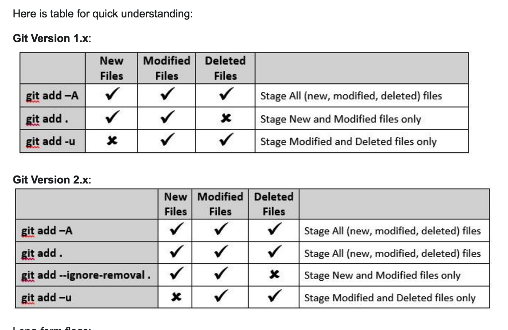
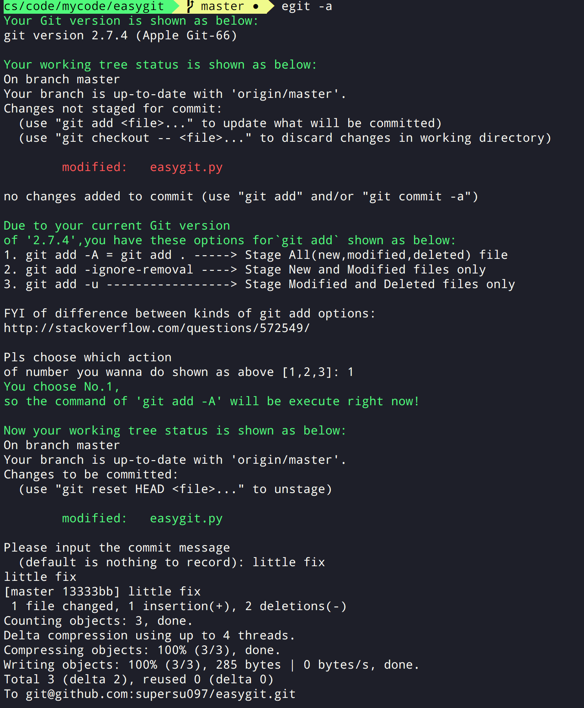

## Easygit
这是一个用来帮助自己在终端下提交代码的小脚本，目前功能比较简单，  
基本够自己用了,后续自己再有什么需求了再慢慢实现。。
### Usage  
```
usage: gp [-h] [-f [FILENAME [FILENAME ...]]] [-o]

a simple py script to help me use git easily

optional arguments:
  -h, --help            show this help message and exit
  -f [FILENAME [FILENAME ...]], --filename [FILENAME [FILENAME ...]]
                        the file you wanna push to the remote git server,
                        support multiple filename as args

Note that: Without any arg passed is mean to execute the ordinary git flow
command then just flow the prompt
```

### Other
对于各种`git add`各种选项如下图：  

详情参考：[StackOverflow: Difference between “git add -A” and “git add .”](http://stackoverflow.com/questions/572549)
### Effect demo

